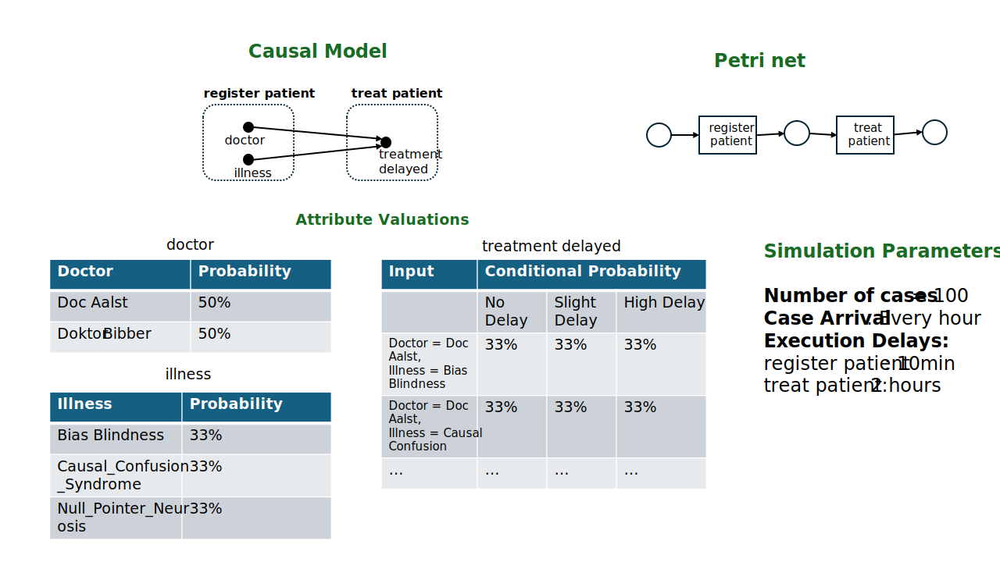

# causal-process-models
Modeling and Simulating Causality in Processes. Instructions:

Execute *main.py*. 

Load generated simulation model (*.cpn*) in CPN Tools.

Run Simulation (In CPN Tools: Simulation Utils -> Run All). This will yield *.csv* files with the simulated event data.

## v1.0 (2024-12-31): 
Added hard-coded example of simplistic process with naive timing behavior. No aggregations. Attributes are categorical. (see below)

